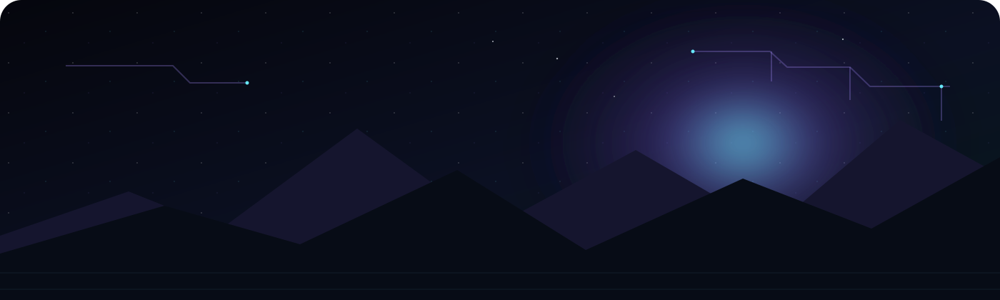
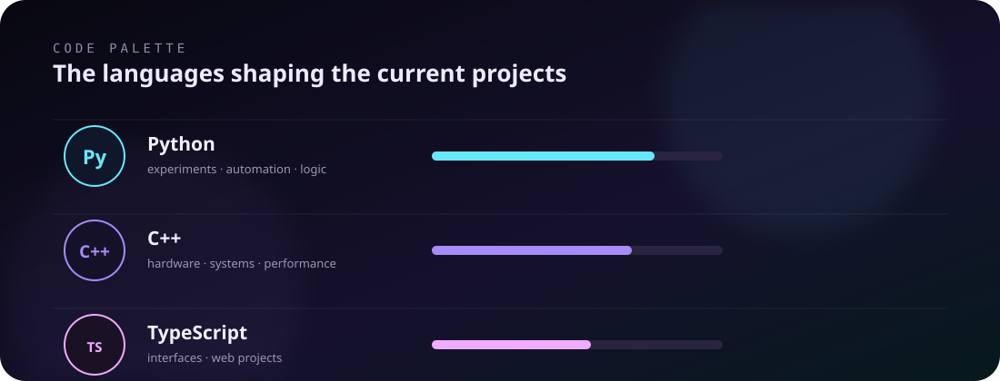

## ◇ What you'll find here

Not a résumé. Not a scoreboard.

Just the projects and experiments I'm actually interested in.

## ◇ Contribution arc

<picture>
  <source media="(prefers-color-scheme: dark)" srcset="https://raw.githubusercontent.com/Himeshbror18/Himeshbror18/output/github-snake-dark.svg">
  <source media="(prefers-color-scheme: light)" srcset="https://raw.githubusercontent.com/Himeshbror18/Himeshbror18/output/github-snake.svg">
  
</picture>

 

More experiments will appear here as they become worth keeping.

