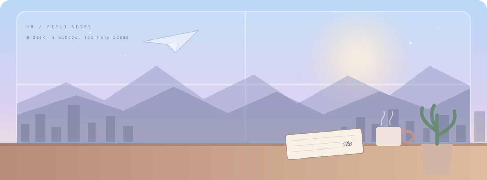
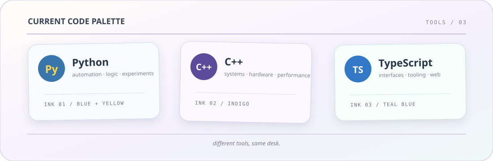

 

## ✦ field notes

I make things that start as a question and become a project.

hardware · software · experiments · whatever seems interesting enough to try

 

 

### ◇ contribution trail

<picture>
  <source media="(prefers-color-scheme: dark)" srcset="https://raw.githubusercontent.com/Himeshbror18/Himeshbror18/output/github-snake-dark.svg">
  <source media="(prefers-color-scheme: light)" srcset="https://raw.githubusercontent.com/Himeshbror18/Himeshbror18/output/github-snake.svg">
  
</picture>

 

More experiments will find their way here.

