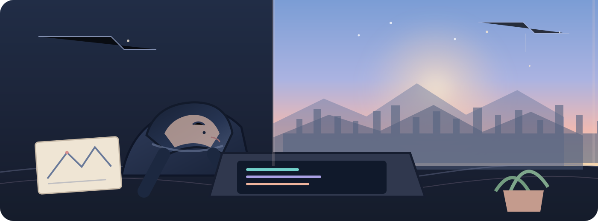

 

### a place for things I actually make

Projects, experiments, hardware, and ideas that start out as a little bit of curiosity.

 

 

### ◇ Contribution arc

<picture>
  <source media="(prefers-color-scheme: dark)" srcset="https://raw.githubusercontent.com/Himeshbror18/Himeshbror18/output/github-snake-dark.svg">
  <source media="(prefers-color-scheme: light)" srcset="https://raw.githubusercontent.com/Himeshbror18/Himeshbror18/output/github-snake.svg">
  
</picture>

 

More experiments will find their way here.

