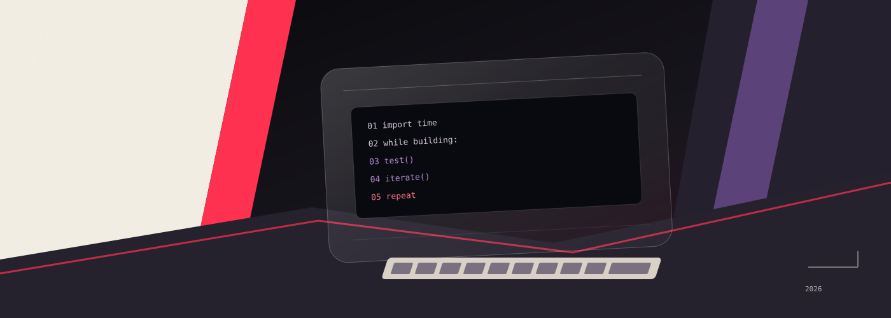
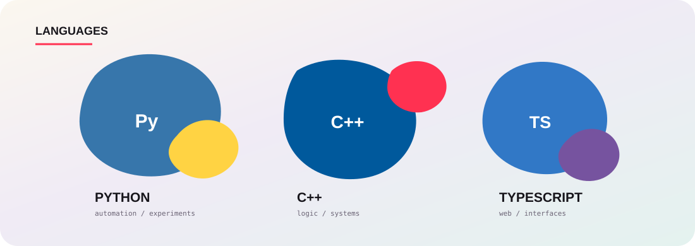

 

 

### ◇ contribution / moving

<picture>
  <source media="(prefers-color-scheme: dark)" srcset="https://raw.githubusercontent.com/Himeshbror18/Himeshbror18/output/github-snake-dark.svg">
  <source media="(prefers-color-scheme: light)" srcset="https://raw.githubusercontent.com/Himeshbror18/Himeshbror18/output/github-snake.svg">
  
</picture>

