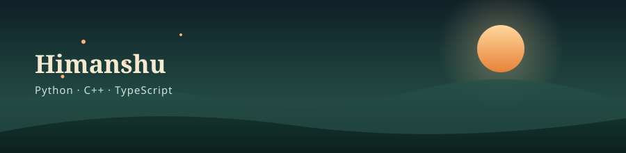

 

## 🌲 About

I'm Himanshu — a student who spends most of my time in **Python**, **C++**, and **TypeScript**, with a soft spot for robotics and microcontroller projects. I like building things that actually do something, not just sit on a screen.

 

## 🛠️ Toolbox

 

## 🍃 What I'm Into

| | |
|---|---|
| 🔧 | Robotics & microcontroller tinkering |
| ⚙️ | Physics & engineering-flavored problem solving |
| 🐍 | Python for scripting, automation, and quick logic |
| 🏗️ | C++ for anything that needs to be fast or close to hardware |
| 🌐 | TypeScript for anything that needs to run in a browser |

 

## 🐍 Contribution Snake

<picture>
  <source media="(prefers-color-scheme: dark)" srcset="https://raw.githubusercontent.com/Himeshbror18/Himeshbror18/output/github-snake-dark.svg">
  <source media="(prefers-color-scheme: light)" srcset="https://raw.githubusercontent.com/Himeshbror18/Himeshbror18/output/github-snake.svg">
  
</picture>

 

GitHub profile · projects · experiments

